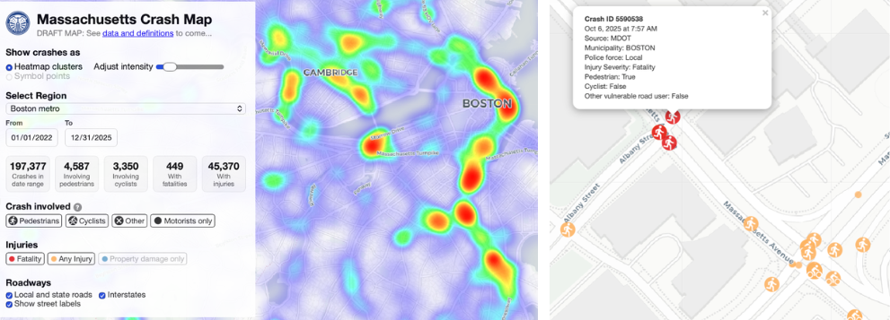

# mass-crash-map

Live map https://picturedigits.github.io/mass-crash-map

Interactive map of crashes involving vulnerable users (pedestrians, cyclists, others) and motorists in Massachusetts. Map built with LeafletJS that uploads CSV data for geographic regions that has been pre-processed and cleaned by Python notebook code.

Features:

- Automatically shifts from heatmap clusters (zoomed out) to symbol points (zoomed in)
- Mobile-first design to compress or expand legend on small screens
- Data for 5 regions across state from MassDOT crash database, plus Boston core region (TESTING) that integrates data from MassDOT and local government sources (City of Boston Vision Zero/Emergency Medical Services; Cambridge Police Department; Somerville Police Department)
- Boston core data cleaning and merging code built by Boston University Spark! data science undergraduate students with BCU
- Filter by crash type (involving pedestrians, cyclists, other vulnerable users, or motorists only)
- Filter by date range (2022 onward), severity (with fatalities, or with any injury), and interstate highway (for MassDOT data only)
- Click symbol points for popup info about specific crashes



## Run map on local computer
- Requires python3
- Serve the repo as a static site, then open `index.html`.
- Example: type in your terminal:
```bash
python3 -m http.server 8000
```
- Then visit `http://localhost:8000`.
- Note: it will only work by double-clicking if the CSV is located on a remote server, not a local file.

## Credits
- Map design by [Jack Dougherty](https://jackdougherty.org) and [Ilya Ilyankou](https://ilyankou.com) at [Picturedigits Ltd](https://www.picturedigits.com)
- Boston core data cleaning and merging by [Boston University Spark!](https://www.bu.edu/spark/) Spring 2026 team: Abby Gualda, Alan Shao, Ethan Freshman, Konstantinos Ilias, Michelle Voong, Nicole Liu, Suhani Kapoor, and Thomas Shin

## Data

**TODO** Add More info to come about data sources and definitions...

Current default data file: `data/metro.csv`

Current time period: 01 Jan 2022 to 31 Dec 2025

Key CSV fields used:
- `lat`, `lng` for map position
- `date`, `time` for crash timestamp
- `severity`, `pedestrian`, `cyclist`, `other`, `interstate` for filters
- `source`, `muni`, `police` for popup details

## Merged data for Boston core with BU Spark!

Data science students from [Boston University Spark!](https://www.bu.edu/spark/) worked with us in Spring 2026 to create code to collect, clean, standardize, and de-duplicate crashes in four municipalities we define as the "Boston core" region: **City of Boston, Brookline, Cambridge, and Somerville**. See details about their work in the [BU Spark! GitHub project repository](https://github.com/BU-Spark/ds-bcu-biking).

We decided to de-duplicate and merge data from four distinct public data sources because each contained data that did not appear in the other. Although MassDOT crash data is the most comprehensive, we found significant numbers of crashes in municipal datasets that did not appear in the MassDOT statewide records. **TODO: clarify differences** For our Boston core region, we compared four public crash data sources listed below. (Since Brookline does not maintain a public crash repository, all crashes in Brookline came solely from the MassDOT dataset.)

| Source | Coverage | API / Endpoint |
|---|---|---|
| MassDOT Open Data Portal | Statewide crashes | ArcGIS FeatureServer REST API |
| City of Boston Vision Zero | Boston crashes | Boston Open Data (CKAN datastore) |
| Cambridge Police Department | Cambridge crashes | Cambridge Open Data (Socrata) |
| Somerville Police Department | Somerville crashes | Somerville Open Data (Socrata) |

BU Spark! students created a Jupyter Notebook of Python code in this repository, called `boston-core-clean-merge.ipynb`, which collects, cleans, standardizes, and de-duplicates crash records for the Boston core region from the four public data sources above. Since MassDOT and municipal crash records exist on separate platforms with no common ID numbers, we defined crashes as highly-likely duplicates if they shared a similar location (within 100 meters) during a shared 60-minute period (**TODO ILLUSTRATE**). The code output is a unified crash dataset that appears **only** in the Boston core region of this map (not the Boston metro region, which shows MassDOT data alone).  

### Steps in Boston core data merger

#### 1. Data Collection
Each source is pulled via paginated API requests (batches of 2,000–5,000 records). All four sources are collected into separate DataFrames (`mass_crashes`, `bvz_crashes`, `ca_crashes`, `so_crashes`).

#### 2. Type Standardization
Across all sources, date/time columns are converted to `datetime` types and latitude/longitude columns are cast to `float64`. Source-specific column names (e.g., `dispatch_ts`, `dtcrash`) are renamed to a common schema (`CRASH_DATE`, `CRASH_TIME`, `LAT`, `LON`, `CITY_TOWN_NAME`).

#### 3. Feature Engineering
New standardized columns are derived from each source's raw fields:

- **`CYCLIST`** — `1` if a cyclist was involved (keywords: `Cyclist`, `Bicyclist`, `Bicycle`), else `0`
- **`PEDESTRIAN`** — `1` if a pedestrian was involved (keywords: `Pedestrian`, `Non-Motorized Wheelchair`, `Roller Skater`), else `0`
- **`OTHER`** — `1` if another vulnerable road user was involved (moped, skateboarder, scooter, etc.), else `0`
- **`SEVERITY`** — `1` for fatal injury, `2` for non-fatal injury, `0` otherwise (MassDOT only)
- **`INTERSTATE`** — `1` if the crash occurred on an interstate, else `0` (MassDOT only)

#### 4. Merging
All four standardized DataFrames are concatenated into a single unified crash DataFrame with a `SOURCE` column tracking the origin of each record.

#### 5. Duplicate Detection
Because the same crash may appear in both MassDOT and a municipal dataset, a custom deduplication algorithm identifies cross-source duplicate pairs:

- Records are sorted by datetime and compared within a sliding time window
- Spatial distance is computed using an approximate Euclidean formula (converted to meters)
- A **confidence score** (0–1) is computed as `0.7 × spatial_score + 0.3 × time_score`, prioritizing spatial proximity
- Thresholds are tested across a grid of time (2, 10, 30, 60 min) and distance (5, 30, 50, 100 m) values
- **Chosen thresholds:** 60 minutes, 100 meters
- When duplicates are found, **MassDOT records are preferred** and the municipal record is dropped

##### 6. Outputs

Three CSV files are produced:

| File | Description |
|---|---|
| `boston-core-all.csv` | All Boston core crash records merged from all four sources, including duplicates |
| `boston-core-clean.csv` | One record per crash event; duplicates removed, MassDOT records prioritized, appears in crash map |
| `boston-core-duplicates.csv` | Side-by-side pairs of records flagged as duplicates, with distance, time difference, and confidence score |

If the notebook cannot be run, pre-generated outputs are available at:
https://drive.google.com/drive/folders/14pxdYQC73GC8VB6watQnqMJ_IBIHDGVv

#### Jupyter Notebook Dependencies

```
pandas
numpy
requests
matplotlib
```

Install via:
```bash
pip install pandas numpy requests matplotlib
```

Run on local computer:
```bash
pip install jupyterlab
```

Launch on local computer:
```bash   
jupyter lab    
```

#### Known Limitations & Notes of Boston core data merger
- **Cambridge PD geocoding:** ~16,911 Cambridge crash records have street addresses but no latitude/longitude. Geocoding these requires a Google Cloud API key (estimated cost ~$200). Commented-out code using `googlemaps` is included at the bottom of the notebook for future use.
- **Duplicate detection runtime:** The nested-loop duplicate finder is O(n²) in the worst case. It is optimized by sorting on datetime and breaking early, but may be slow on very large datasets.
- **Time unreliability:** Time data across sources varies in precision and reliability. This is why spatial proximity is weighted more heavily (0.7) than time proximity (0.3) in the confidence score.


## License

GNU General Public License v3.0
