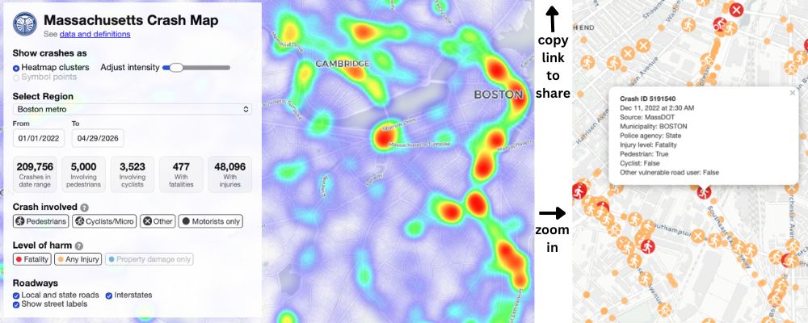

# mass-crash-map

## Live links
- https://picturedigits.github.io/mass-crash-map
- https://labs.bostoncyclistsunion.org/crashes/

Interactive map of crashes involving vulnerable roadway users (pedestrians, cyclists, others) and motorists for various regions in Massachusetts. Python notebooks clean and merge data from public sources in CSV format, which LeafletJS code displays as heatmap clusters or symbol map points.

## Credits
- Map design by [Jack Dougherty](https://jackdougherty.org) and [Ilya Ilyankou](https://ilyankou.com) at [Picturedigits Ltd](https://www.picturedigits.com) in collaboration with [BCU Labs](https://labs.bostoncyclistsunion.org) of the [Boston Cyclists Union](https://bostoncyclistsunion.org)
- Python notebook data cleaning and merging by [Boston University Spark!](https://www.bu.edu/spark/) Spring 2026 team: Abby Gualda, Alan Shao, Ethan Freshman, Konstantinos Ilias, Michelle Voong, Nicole Liu, Suhani Kapoor, and Thomas Shin. See their original work in this [BU Spark! BCU Biking repo](https://github.com/BU-Spark/ds-bcu-biking), which Jack Dougherty modified and included in the `data` folder of this repo.

## Map
- Zooming in automatically shifts display from broad heatmap clusters to street-level symbol points
- Mobile-first design works both on smaller screens (click arrow to expand legend on smartphone) and larger screens
- Copy browser link to share your view of the map (location, zoom level, data layer) with others
- Filter by crash type (involving pedestrians, cyclists & micromobility users, other vulnerable users, or motorists only)
- Filter by date range (2021 onward), severity (with fatalities, or with any injury), and interstate highway (for MassDOT data only)
- Click symbol points for popup info about specific crashes

- [Share your feedback about the Mass Crash Map](https://forms.gle/kLhR3muWdTuQtSz58) with BCU Labs



## Data
We downloaded, cleaned, and merged data from public sources to make it easier to visualize crash patterns involving vulnerable users, specifically pedestrians, cyclists, and micromobility users.

**Crash data last updated on 1 September 2026** from sources below, and will be updated monthly.
<!-- TODO update line above, index (line 40), AND start/end dates in script.js (around line 78) -->

**Caution:** Crash reports may appear several weeks (or months) after the actual incident due to time required for police or EMS to complete them (especially for crashes that require police to receive toxicology reports), and lag time for municipal or state authorities to upload these reports into public datasets.

| Source | Coverage | API / Endpoint |
|---|---|---|
| [Mass GeoDOT Open Data Portal](https://geodot-massdot.hub.arcgis.com/pages/open-data-portal) | Statewide | [ArcGIS FeatureServer REST API](https://gis.crashdata.dot.mass.gov/arcgis/rest/services/MassDOT) |
| Sources coming soon |  |  |
| [City of Boston Vision Zero](https://data.boston.gov/organization/vision-zero-boston-program) | Boston | Boston Open Data (CKAN datastore) |
| [Cambridge Police Department Crash Log](https://data.cambridgema.gov/Public-Safety/CPD-Crash-Log/h6fp-bp8s/about_data) | Cambridge | Cambridge Open Data (Socrata) |
| [Somerville Police Data Crashes](https://data.somervillema.gov/Public-Safety/Police-Data-Crashes/mtik-28va/about_data) | Somerville | Somerville Open Data (Socrata) |

DISCLAIMER from [MassDOT Impact crash data site](https://apps.crashdata.dot.mass.gov/cdp/home): "MassDOT makes no representation as to the accuracy, adequacy, reliability, availability or completeness of the crash records or the data collected from them and is not responsible for any errors or omissions in such records or data. Under no circumstance will MassDOT have any liability for any loss or damage incurred by any party as a result of the use of the crash records or the data collected from them...In addition, any crash records or data provided for the years after 2022 are subject to change at any time and are not to be considered up-to-date or complete. As such, open years’ of crash data are for informational purposes only and should not be used for analysis..."

<!-- TODO: ADD DISCLAIMERS for City of Boston Vision Zero... and other public sources -->

#### Defining Massachusetts regions
Since various state agencies define regions in various ways, we carved  the state into five areas by re-grouping the 13 Regional Planning Areas acronyms (which appear in the MassDOT crash data) into 5 more commonly-used geographic terms:

```
boston-metro = ['MAPC']
#central = ['MRPC','CMRPC']
#northeast = ['NMCOG','MVPC']
#southeast = ['CCC','MVC','NRPEDC','OCPC','SRPEDD']
#western = ['BRPC','FRCOG','PVPC']
```

#### Data structure
We merged all data into one CSV with the following structure, where each row is an individual crash, and columns show attributes of each crash:

- source: of crash data (MassDOT, BostonVZInjury, BostonVZFatality)
- id: unique identifier of each crash (originals from MassDOT; created our own from index number for Boston Vision Zero)
- muni: the municipality where crash was reported (e.g. Boston, Cambridge, Somerville)
- year: in YYYY format (for easier data quality checks)
- date: in yyyy-mm-dd format
- severity: 1 if crash involved one or more fatalities, 2 if crash involved one or more suspected injuries of any time, and blank if neither or not reported
- time: in hh:mm am
- police: type of police agency that reported crash (Local, State, MBTA or Campus), only in MassDOT Records
- pedestrian: 1 if pedestrian (or similar slow-speed vulnerable user) was involved in the crash, 0 or blank if not reported. See definition further below
- cyclist: 1 if cyclist (or similar medium-speed micromobility user) was involved in the crash, 0 or blank if not reported. See definition further below
- other: 1 if higher-speed vulnerable user (moped or "motorized bicyclist" or "motorized scooter" as defined by MA General Law), OR "other" type of vulnerable user that does not neatly fit above (e.g. trolley/train passenger) was involved in the crash, 0 or blank if not reported. See definition further below
- lat: latitude of the location of crash report
- lon: longitude of the location of crash report
- interstate: 1 if the crash occurred on an interstate highway, 0 or blank if not (only in MassDOT data)

#### Grouping Vulnerable Roadway Users into 3 Broad Categories
We collaborated with a team of undergraduate data science students from [Boston University Spark!](https://www.bu.edu/spark/) to make crash reports more meaningful for public use. First, the BU Spark! team wrote Python code notebooks to download and pre-process public crash data to be displayed in the map. For example, MassDOT collect crash reports filed by state and local police officers across the state, who use forms with more than 20 different labels for various types of vulnerable roadway users. We grouped these labels into three broad categories, based on their general speed relative to each other:

- Slower-speed vulnerable users, such as pedestrians and people in wheelchairs
- Medium-speed vulnerable users, such as bicyclists, skaters, and non-motorized scooters
- Higher-speed vulnerable users, such as "motorized bicyclists" and "motorized scooters" (with a gas motor, as currently defined by MA General Law) and "other" users who do not neatly fit into categories above (such as trolley/train passengers)

The MassDOT crash reports include two columns were police officers may select from a drop-down menu of various types of vulnerable users, or harmful events that involved vulnerable users. However, these two columns are not always internally consistent. For example, a crash report may list "Pedestrian" as a Non-Motorist Type in column 1, but might not include "Collision with pedestrian" as Most Harmful Event in column 2, and vice versa.

- NON_MTRST_TYPE_CL (Non-Motorist Type), shown as column1 below
- MOST_HRMFL_EVT_CL (Most Harmful Event), shown as column2 below

TODO - REFORMAT as table with column1 terms (Bicyclist) vs column2 terms (Collision with Cyclist), etc

Pedestrians - and related users who generally travel at LOW speeds

- Pedestrian in column1, OR Collision with pedestrian in column2
- Electric Personal Assistive Mobility Device User
- Non-Motorized Wheelchair User TODO check for other types of wheelchairs
- Emergency Responder - Outside of vehicle
- Roadway Worker - Outside of vehicle
- Utility Worker - Outside of vehicle

Cyclists - and related micromobility users who generally travel at MEDIUM speeds

- Bicyclist in column1, OR Collision with cyclist (bicycle, tricycle, unicycle, pedal car) in column2
- Hand Cyclist
- Inline Skater
- Non-Motorized Scooter Rider
- Other Micromobility Device User
- Roller Skater
- Skateboarder
- Tricyclist

Other vulnerable users who generally travel at HIGHER speeds OR do not fit either category above OR are unknown

- Other in column1, OR Collision with Other Vulnerable Users in column2
- Motorized Bicyclist in column1, OR Collision with moped in column2
- Motorized Scooter Rider
- Train/Trolley Passenger
- Farm Equipment Operator
- Unknown

We do not intend these columns to be mutually exclusive. For example, if a MassDOT crash recorded both a pedestrian and a cyclist as vulnerable users, both columns would have a value of 1. However, crash records from some local government sources (such as Boston Vision Zero) are mutually exclusive and report only "ped" or "bike" (or "mv" for motor vehicle).

#### Known Data Limitations
- **Unreliable timestamps:** Time data across sources varies in reliability. During testing, it may be *possible* that City of Boston Vision Zero data has a 4- or 5-hour time zone shift from Eastern Time to Greenwich Mean Time (UTC). This is why spatial proximity is weighted more heavily than time proximity in the confidence score.
- **Duplicate detection runtime:** The nested-loop duplicate finder is O(n²) in the worst case. It is optimized by sorting on datetime and breaking early, but may be slow on very large datasets.
- **Cambridge PD geocoding:** ~16,911 Cambridge crash records have street addresses with latitude/longitude at the end of the address field, OR no latitude/longitude but sometimes intersecting streets. We need more testing to clean and extract lat/long, or geocoding intersecting streets using a resource such as Google Cloud API key (estimated cost ~$200). Commented-out code using `googlemaps` is included at the bottom of the notebook for future use.

## TESTING AND EDITING -- Boston Core Data: Merge and Clean with BU Spark!

Data science students from [Boston University Spark!](https://www.bu.edu/spark/) worked with us in Spring 2026 to create code to collect, clean, standardize, and de-duplicate crashes in four municipalities we define as the "Boston core" region: **City of Boston, Brookline, Cambridge, and Somerville**. See details about their work in the [BU Spark! GitHub project repository](https://github.com/BU-Spark/ds-bcu-biking).

We decided to de-duplicate and merge data from four distinct public data sources because each contained data that did not appear in the other. Although MassDOT crash data is the most comprehensive, we found significant numbers of crashes in municipal datasets that did not appear in the MassDOT statewide records. **TODO: clarify differences** For our Boston core region, we compared four public crash data sources listed below. (Since Brookline does not maintain a public crash repository, all crashes in Brookline came solely from the MassDOT dataset.)

BU Spark! students created a Jupyter Notebook of Python code in this repository, called `boston-core-merge-clean.ipynb`, which collects, cleans, standardizes, and de-duplicates crash records for the Boston core region from the four public data sources above. Since MassDOT and municipal crash records exist on separate platforms with no common ID numbers, we defined crashes as highly-likely duplicates if they shared a similar location (within 100 meters) during a shared 60-minute period (**TODO ILLUSTRATE**). The code output is a unified crash dataset that appears **only** in the Boston core region of this map (not the Boston metro region, which shows MassDOT data alone).  

### Steps in Boston Core Data Merge and Clean

#### 1. Data Collection
Each source is pulled via paginated API requests (batches of 2,000–5,000 records). All four sources are collected into separate DataFrames (`mass_crashes`, `bvz_crashes`, `ca_crashes`, `so_crashes`).

#### 2. Type Standardization
Across all sources, date/time columns are converted to `datetime` types and latitude/longitude columns are cast to `float64`. Source-specific column names (e.g., `dispatch_ts`, `dtcrash`) are renamed to a common schema (`CRASH_DATE`, `CRASH_TIME`, `LAT`, `LON`, `CITY_TOWN_NAME`).

#### 3. Feature Engineering
New standardized columns are derived from each source's raw fields:

- **`CYCLIST`** — `1` if a cyclist was involved (keywords: `Cyclist`, `Bicyclist`, `Bicycle`), else `0`
- **`PEDESTRIAN`** — `1` if a pedestrian was involved (keywords: `Pedestrian`, `Non-Motorized Wheelchair`, `Roller Skater`), else `0`
- **`OTHER`** — `1` if another vulnerable road user was involved (moped, skateboarder, scooter, etc.), else `0`
- **`SEVERITY`** — `1` for fatal injury, `2` for non-fatal injury, `0` otherwise (MassDOT only)
- **`INTERSTATE`** — `1` if the crash occurred on an interstate, else `0` (MassDOT only)

#### 4. Merging
All four standardized DataFrames are concatenated into a single unified crash DataFrame with a `SOURCE` column tracking the origin of each record.

#### 5. Duplicate Detection
Because the same crash may appear in both MassDOT and a municipal dataset, a custom deduplication algorithm identifies cross-source duplicate pairs:

- Records are sorted by datetime and compared within a sliding time window
- Spatial distance is computed using an approximate Euclidean formula (converted to meters)
- A **confidence score** (0–1) is computed as `0.7 × spatial_score + 0.3 × time_score`, prioritizing spatial proximity
- Thresholds are tested across a grid of time (2, 10, 30, 60 min) and distance (5, 30, 50, 100 m) values
- **Chosen thresholds:** 60 minutes, 100 meters
- When duplicates are found, **MassDOT records are preferred** and the municipal record is dropped

##### 6. Outputs
Create 3 files in `/data` folder:
* boston-core-all-merged.csv - contains ALL MERGED crash records from different sources, including duplicates
* boston-core-duplicates-removed.csv - contains DUPLICATES REMOVED and displayed as side-by-side pairs of matched crash records for easy comparison
* boston-core.csv - contains CLEANED data, after duplicates removed, with one instance for each crash, prioritizing MassDOT data because it is more comprehensive

#### Jupyter Notebook Dependencies

```
pandas
numpy
requests
matplotlib
```

Install via:
```bash
pip install pandas numpy requests matplotlib
```

Run on local computer:
```bash
pip install jupyterlab
```

Launch on local computer:
```bash   
jupyter lab    
```

### Run map on your local computer
- Requires python3
- Serve the repo as a static site, then open `index.html`.
- Example: type in your terminal:
```bash
python3 -m http.server 8000
```
- Then visit `http://localhost:8000`.
- Note: it will only work by double-clicking if the CSV is located on a remote server, not a local file.

## License

GNU General Public License v3.0
